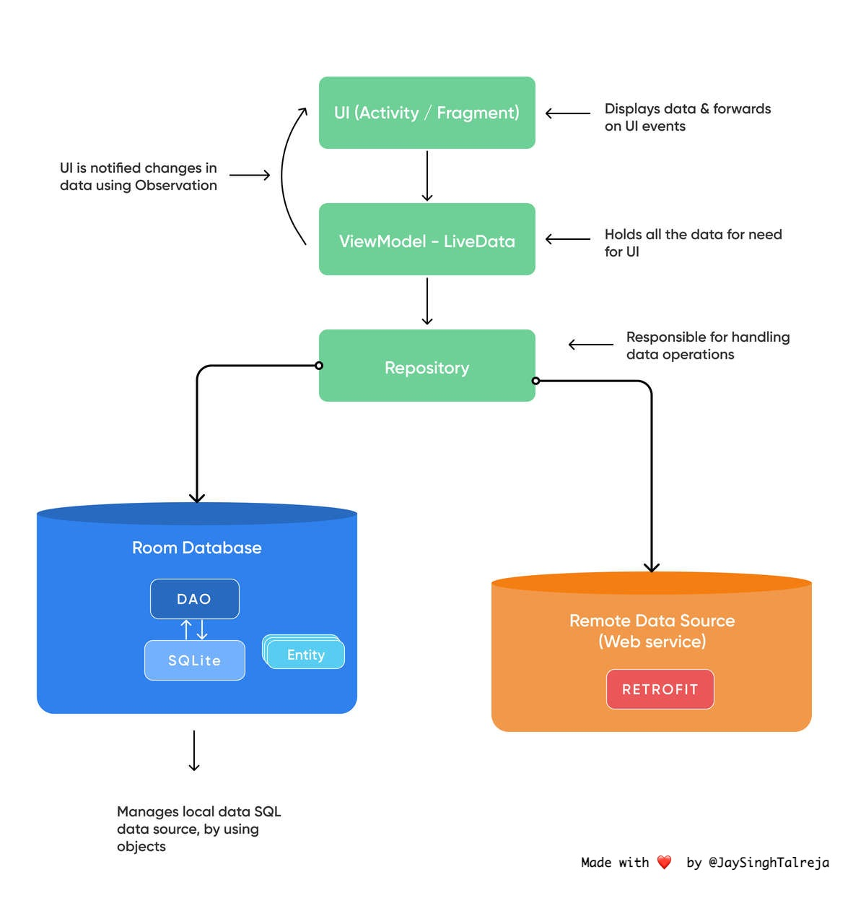

# CinePop 🍿

A minimalistic movie listing app to browse IMDB's top 250 movies,
built to *demonstrate MVVM with Jetpack Compose*.

<br />


## Designs - Dark Mode Available 🌙

<br />

## Built With 🛠

- [Kotlin](https://kotlinlang.org/) - First class and official programming language for Android development.
- [Coroutines](https://kotlinlang.org/docs/reference/coroutines-overview.html) - For asynchronous and more..
- [Flow](https://kotlin.github.io/kotlinx.coroutines/kotlinx-coroutines-core/kotlinx.coroutines.flow/-flow/) - A cold asynchronous data stream that sequentially emits values and completes normally or with an exception.
- [Compose](https://developer.android.com/jetpack/compose) - Android’s modern toolkit for building native UI.
- [Navigation](https://developer.android.com/guide/navigation) - A set of libraries, a plugin, and tooling that simplifies Android navigation.
- [Android Architecture Components](https://developer.android.com/topic/libraries/architecture) - Collection of libraries that help you design robust, testable, and maintainable apps.
  - [LiveData](https://developer.android.com/topic/libraries/architecture/livedata) - Data objects that notify views when the underlying database changes.
  - [ViewModel](https://developer.android.com/topic/libraries/architecture/viewmodel) - Stores UI-related data that isn't destroyed on UI changes.
  - [Room](https://developer.android.com/topic/libraries/architecture/room) - SQLite object mapping library.
- [Hilt](https://dagger.dev/hilt/) - Dependency Injection Framework
- [Retrofit](https://square.github.io/retrofit/) - A type-safe HTTP client for Android and Java.
- [Moshi](https://github.com/square/moshi) - A modern JSON library for Kotlin and Java.
- [Moshi Converter](https://github.com/square/retrofit/tree/master/retrofit-converters/moshi) - A Converter which uses Moshi for serialization to and from JSON.
- [Coil](https://github.com/chrisbanes/accompanist/blob/main/coil/README.md) - An image loading library for Android.
- [Material Components for Android](https://github.com/material-components/material-components-android) - Modular and customizable Material Design UI components for Android.

<br />

## Architecture 🗼

This project follows the famous MVVM architecture and best practices from Google's [GithubBrowserSample](https://github.com/android/architecture-components-samples/tree/master/GithubBrowserSample)



<br />

## Project Structure 📂

```
├── App.kt
├── data
│   ├── local
│   │   ├── AppDatabase.kt
│   │   ├── Converters.kt
│   │   └── daos
│   │       └── MoviesDao.kt
│   ├── remote
│   │   ├── ApiInterface.kt
│   │   └── Movie.kt
│   └── repo
│       └── MoviesRepo.kt
├── di
│   └── modules
│       ├── DatabaseModule.kt
│       ├── NetworkModule.kt
│       └── PreferenceModule.kt
├── model
│   └── Category.kt
├── ui
│   ├── common
│   │   ├── Fakes.kt
│   │   ├── Poster.kt
│   │   └── RetryMessage.kt
│   ├── main
│   │   ├── MainActivity.kt
│   │   └── MainViewModel.kt
│   ├── screen
│   │   ├── detail
│   │   │   ├── MovieDetailFragment.kt
│   │   │   ├── MovieDetailScreen.kt
│   │   │   └── MovieDetailViewModel.kt
│   │   ├── movies
│   │   │   ├── MoviesFragment.kt
│   │   │   ├── MoviesScreen.kt
│   │   │   └── MoviesViewModel.kt
│   │   └── splash
│   │       ├── SplashFragment.kt
│   │       ├── SplashScreen.kt
│   │       └── SplashViewModel.kt
│   ├── test
│   │   ├── TestActivity.kt
│   │   └── TestViewModel.kt
│   └── theme
│       ├── Theme.kt
│       └── Typography.kt
└── utils
    ├── calladapter
    │   └── flow
    │       ├── FlowResourceCallAdapterFactory.kt
    │       ├── FlowResourceCallAdapter.kt
    │       └── Resource.kt
    ├── flow
    │   └── EventFlow.kt
    └── NetworkBoundResource.kt

21 directories, 34 files
```
<br />

## Credits 🤗

- 🤓 Icons are from [flaticon.com](https://www.flaticon.com/) 
- 🖌️ Design inspired from [AnimeXStream](https://github.com/mukul500/AnimeXStream)

<br />

## TODO 🗒️

  - [ ] Improve algorithms and code review
  - [ ] Add test cases
